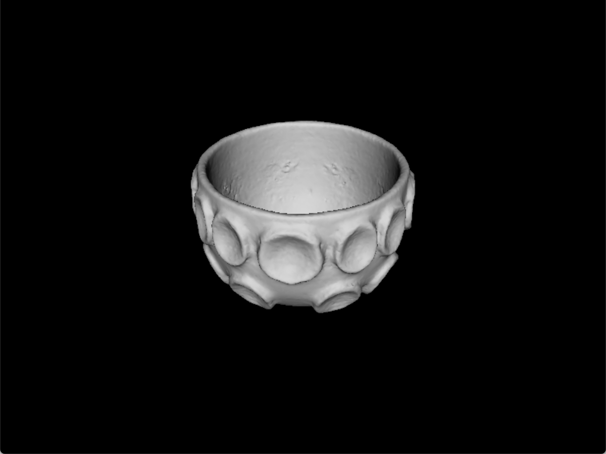
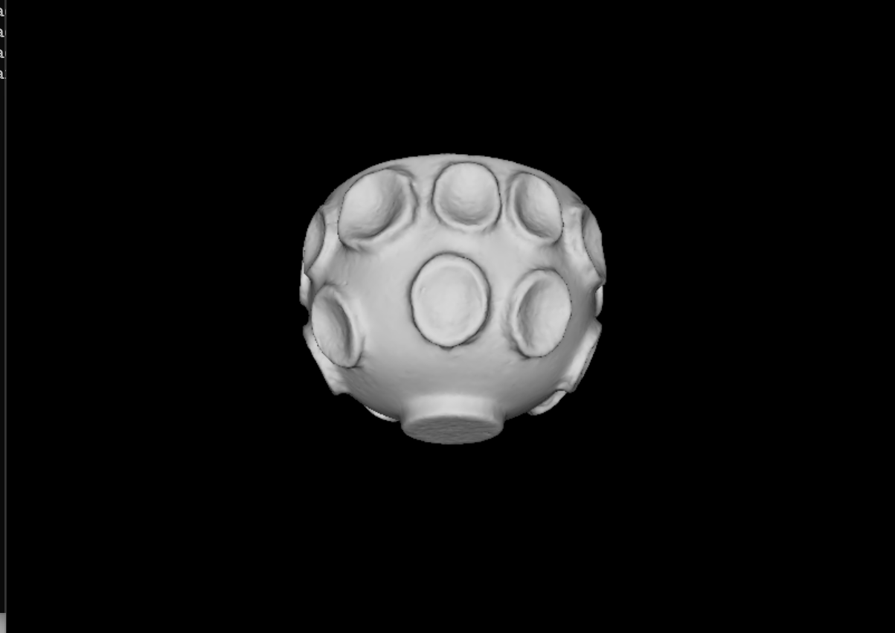

# C-Model-Visuliazer

# 🧊 GLB-3-Lighting: Simple GLB Visualizer

  

**[English]** A lightweight, dependency-free (almost) 3D viewer for `.glb` files using legacy OpenGL (GLUT) and `tinygltf`. It demonstrates parsing binary glTF files, extracting mesh data, and rendering it with basic Phong lighting.

**[简体中文]** 一个基于传统 OpenGL (GLUT) 和 `tinygltf` 的轻量级 `.glb` 文件查看器。本项目演示了如何解析二进制 glTF 文件、提取网格数据，并使用基础的冯氏光照模型进行渲染。

---

## ✨ Demo / 演示

### 📸 Screenshots / 截图

| **Front View / 正视图** | **Bottom View / 仰视图** |
|:---:|:---:|
|  |  |


### 🎥 Video / 视频演示
See it in action. Watch the rotation and lighting.
点击观看动态演示，注意旋转和光照效果。

[![Watch the video]](./Demo-GIF.gif)

---


## 🚀 Features / 功能特性

* **GLB Parsing / GLB 解析**: Native support for binary glTF files. (原生支持二进制 glTF 文件)
* **Mesh Extraction / 网格提取**: Automatically handles `POSITION`, `NORMAL`, and `INDICES`. (自动处理顶点、法线和索引)
* **Dynamic Lighting / 动态光照**: A "Headlight" that follows the camera position. (跟随摄像机的“头灯”效果)
* **Interactive / 交互控制**: Mouse dragging to rotate the model. (鼠标拖拽旋转模型)
* **Cross-Platform / 跨平台**: Based on standard GLUT (works on Windows/Linux/macOS). (基于标准 GLUT)

---

## 🛠️ Getting Started /以此开始

### Dependencies / 依赖项
You need to feed the code these libraries to make it happy.
你需要满足代码的这些胃口：

1.  **C++ Compiler**: Support for C++17 or C++20.
2.  **OpenGL / GLUT**: 
    * **Windows**: Install via NuGet (`nupengl.core`) or manually link `freeglut`.
    * **Linux**: `sudo apt-get install freeglut3-dev`
3.  **tinygltf**: Included as a single header (ensure `tiny_gltf.h` is in the path).

### Build & Run / 编译与运行

1.  **Clone the repo / 克隆仓库**
    ```bash
    git clone [https://github.com/your-username/glb-3-lighting.git](https://github.com/your-username/glb-3-lighting.git)
    cd glb-3-lighting
    ```

2.  **Prepare the Model / 准备模型**
    Place your `.glb` file in the project root and name it `model.glb` (or pass the path as an argument).
    将你的 `.glb` 文件放在项目根目录并命名为 `model.glb`（或者通过参数传入路径）。

3.  **Compile (Visual Studio) / 编译 (Visual Studio)**
    * Open `glb-3-lighting.slnx`.
    * Ensure dependencies (GLUT) are linked.
    * Press **F5**.
      
Sample Folder Structure


4.  **Controls / 操作方法**
    * **Left Mouse Button + Drag**: Rotate the model (X/Y axis).
    * **左键拖拽**: 旋转模型（X/Y 轴）。

---
